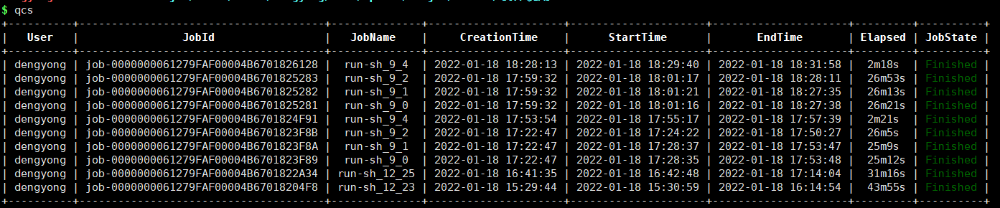

#### qcs阿里云任务管理

`qcs`命令是用于查看和删除`runbatch/runsge`投递到阿里云上任务的API。通过阿里云batchcompute接口连接阿里云资源并查看相关信息。支持用户区分，能查看不同用户的阿里云任务，但只能删除本用户的任务。

##### 参数介绍

输入命令`qcs --help`可查看参数配置，各参数介绍如下：

| 参数                | 描述                                                         |
| ------------------- | ------------------------------------------------------------ |
| -h/--help           | 打印帮助信息并退出                                           |
| -t/--top            | 显示当前用户的前多少个任务，默认前10个任务                   |
| -a/--all            | 显示当前用户的全部阿里云任务                                 |
| -n/--name           | 根据任务名过滤显示任务                                       |
| -u/--user           | 显示指定用户名的任务，默认当前用户名                         |
| -r/--region          | 阿里云连接的区域，默认北京                                   |
| -d/--delete         | 删除指定任务id的任务，只能删除当前用户的任务                 |
| -j/--job            | 打印指定任务id的详细任务信息                                 |
| --access-key-id     | 连接阿里云使用的访问id，若不传入该参数，会从配置文件中读取，传入时，会覆盖配置文件中的指定 |
| --access-key-secret | 连接阿里云使用的密钥，若不传入该参数，会从配置文件中读取，传入时，会覆盖配置文件中的指定 |
| -ini/--ini          | 程序运行的配置文件，默认配置文件路径为：`$HOME/.runjobconfig`或软件安装路径下的`runjobconfig`文件，默认路径可通过`runbatch -config`查看 |
| -config/--config    | 打印配置文件和参数信息并退出                                 |
| -v/--version        | 打印当前软件版本并退出                                       |

##### 使用说明

+ `runbatch`任务投递到阿里云服务器上运行时，会自动加上用户名信息，`qcs`利用任务的用户名信息区分不同用户的任务
+ 删除阿里云任务时，请确认是否确定删除。
+ 使用前须准备好配置文件`$HOME/.runjobconfig`，配置文件说明可参考`配置文件说明`

##### 任务查看结果说明

输入`qcs`命令即可查看当前阿里云计算任务

第一列表示用户名

第二列表示任务id

第三列表示任务名，为`runbatch`投递任务时指定的任务名

第四列表示任务创建时间

第五列表示任务开始运行时间

第六列表示任务运行结束时间

第七列表示任务运行时间

第八列表示任务运行状态，可能的状态有`waiting/running/stopped/failed/finished`

可通过`qcs -j`加任务id，查看某个任务的详细信息。

