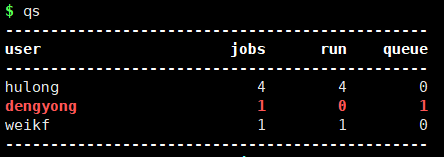
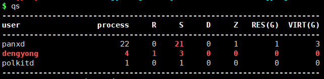
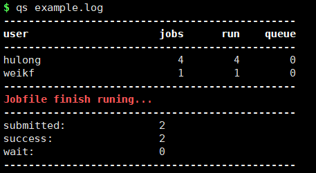
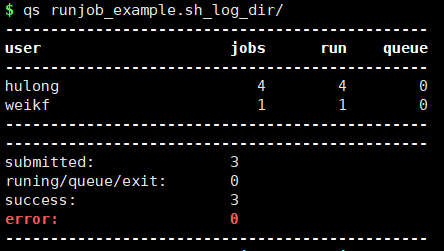
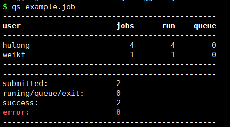

#### qs集群和本地任务查看

`qs`命令用于快速查看由`runjob`或`runbatch`投递管理的任务状态，主要有4种查看用法。

##### 直接查看

直接输出`qs`命令，可查看当前SGE集群或本地服务器各用户分别运行的任务数。

SGE集群环境下，输出集群中个用户运行的任务数，jobs表示总任务数，run表示正在运行中的任务，queue表示排队中的任务数。

非SGE集群环境，则会统计当前服务器中各用户的相关进程数。`process`表示总进程数，`R`表示处在run状态的进程数，`S`表示处在sleep状态的进程数，`D`表示dead状态的进程数，`Z`表示zombie状态的进程，`RES`表示用户使用的总的实际内存，`VIRT`表示用户使用的总的虚拟内存。

##### 日志文件查看

`qs`命令传入`runjob`或`runbatch`输出的日志文件，即可分析该日志文件中全部任务的任务状态。

##### 日志文件夹查看

`qs`命令传入`runjob`或`runbatch`输出的文件夹，即可分析该日志文件夹中全部任务的任务状态。

##### 任务文件查看

`qs`命令传入`runjob`的流程job文件，即可查看该流程中全部任务的运行状态

