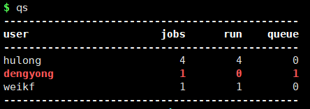
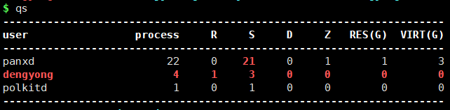
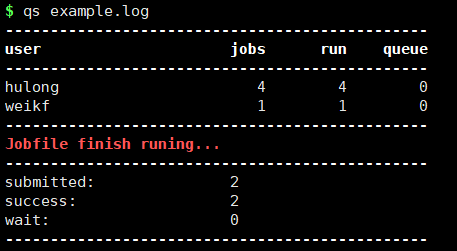
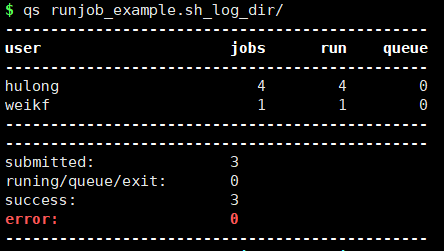
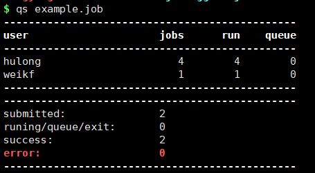

#### qs 集群和本地任务查看

`qs`命令用于快速查看由`runshell`或`runjob`投递管理的任务状态，支持SGE集群和本地环境。`qslurm`命令用于Slurm集群环境。

##### 直接查看

直接输入`qs`命令，可查看当前SGE集群或本地服务器各用户分别运行的任务数。

SGE集群环境下，输出集群中各用户运行的任务数，jobs表示总任务数，run表示正在运行中的任务，queue表示排队中的任务数。

非集群环境（本地服务器），则会统计当前服务器中各用户的相关进程数。`process`表示总进程数，`R`表示处在run状态的进程数，`S`表示处在sleep状态的进程数，`D`表示disk-sleep状态的进程数，`Z`表示zombie状态的进程，`RES(G)`表示用户使用的实际内存（GB），`VIRT(G)`表示用户使用的虚拟内存（GB）。

##### Slurm集群查看

`qslurm`命令用于查看Slurm集群中各用户运行的任务数和排队情况。

##### 日志文件查看

`qs`命令传入`runjob`或`runshell`输出的日志文件（`.log`后缀或程序日志），即可分析该文件中全部任务的任务状态。

##### 日志文件夹查看

`qs`命令传入`runjob`或`runshell`输出的日志文件夹，即可分析该文件夹中全部任务的任务状态。

##### 任务文件查看

`qs`命令传入`runjob`的流程job文件，即可查看该流程中全部任务的运行状态：

